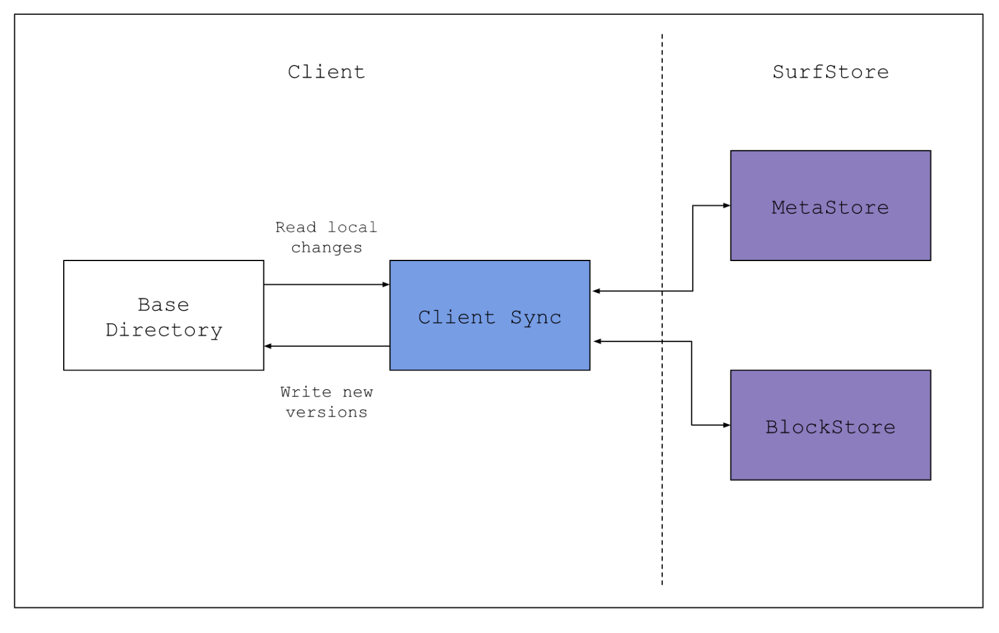

# Surf Store #

## What is Surf Store? ##
Surf store is a cloud based file storage and syncing system like Drop Box. 
It is based on protocol buffers using (gRPC Remote Procedure Calls).  
There is a MetaStore for and a BlockStore service. 
### MetaStore ###
The MetaStore service manages the metadata of files and the entire system. Most importantly, the MetaStore service holds the mapping of filenames to blocks. Furthermore, it should be aware of available BlockStores and map blocks to particular BlockStores.  In a real deployment, a cloud file service like Dropbox or Google Drive will hold exabytes of data, and so will require 10s of thousands of BlockStores or more to hold all that data.
### BlockStore ###
The content of each file in SurfStore is divided up into chunks, or blocks, each of which has a unique identifier. This service stores these blocks, and when given an identifier, retrieves and returns the appropriate block.

## How to use Surf Store? ##
1. Download and Install Go https://go.dev/doc/install
2. Download plugins for gRPC
   1. go install google.golang.org/protobuf/cmd/protoc-gen-go@v1.28
   2. go install google.golang.org/grpc/cmd/protoc-gen-go-grpc@v1.2
3. Then run the server
   1. go run cmd/SurfstoreServerExec/main.go -s &lt;service> -p &lt;port> -l -d (BlockStoreAddr*)
      1. &lt;service> can be meta store, block store, or both. (run both services on the same port)
      2. e.g: go run cmd/SurfstoreServerExec/main.go -s both -p 8081 -l localhost:8081
      3. You can also use **make run-both**
4. Then run client (Sync)
   1. Once you create a folder (e.g dataA), provide a path to that folder to sync
   2. Before you sync to the server, you can modify or delete files. For multiple clients, syncing will be based on versioning.
   3. go run cmd/SurfstoreClientExec/main.go server_addr:port &lt;folder path> &lt;blockSize>
      1. blockSize is how big are the blocks in bytes for the data.
      2. e.g go run cmd/SurfstoreClientExec/main.go localhost:8081 dataA 4096
      3. e.g go run cmd/SurfstoreClientExec/main.go localhost:8081 dataB 4096
